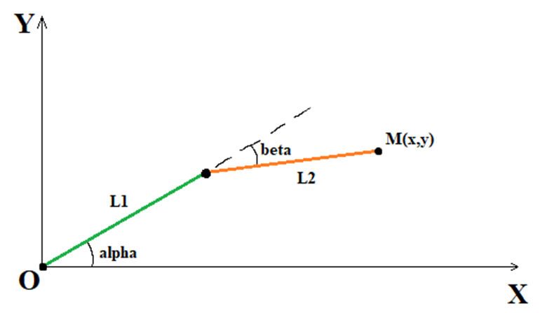

# Обратная кинематика

У робота есть 2 шарнира (joints), в которых установлены электродвигатели. Пусть угол поворота первого двигателя – alpha, второго – beta. Двигатели соединены звеном (link) длиной L1. Второе звено длиной L2 соединяет двигатель и фломастер, он же рабочий орган робота (end effector). Про такого робота говорят, что он имеет 2 степени свободы (degree of freedoms).
Построим математическую модель такого робота. Так как фломастер движется только в плоскости, можно работать в двумерном пространстве.
Введем систему координат OXY. Оба звена представим в виде отрезков. Шарниры и рабочий орган – точки (рис. 2).

Рис. 2. Схематичное изображение робота.

	Особенно важна точка M(x,y) – это координата пишущей части фломастера. 
Любая фигура может быть представлена некоторым конечным набором точек Mi, i = 1..n. В каждую из этих точек необходимо последовательно переместить фломастер.
Положение фломастера регулируется углами alpha и beta, чтобы их рассчитать при известной точке M(x,y), применяется задача обратной кинематики (inverse kinematics).

    *тут должно быть продолжение мат. модели, но я не хочу дублировать статьи https://habr.com/ru/post/358798/ и https://robocraft.ru/mechanics/756*

Реализуйте класс KinematicSolver. Предусмотрите возможность задания длин звеньев L1 и L2, получения углов alpha и beta, функцию Solve(x,y), которая будет рассчитывать углы по заданным координатам. Продемонстрируйте ваше решение.

